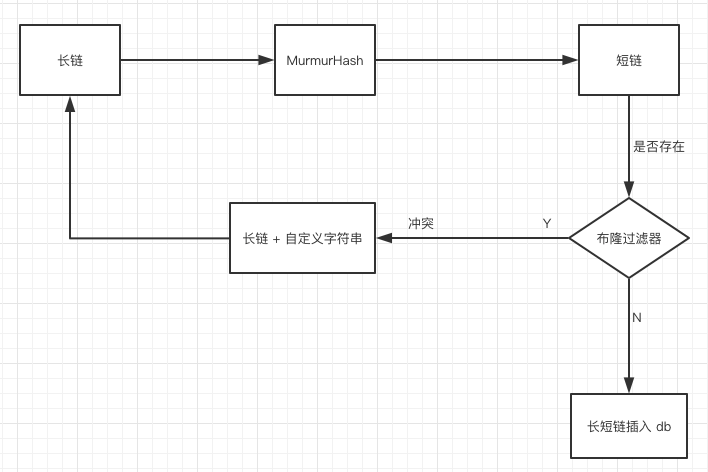

系统架构设计
分层架构 ：

网关层 ：Spring Cloud Gateway（路由、限流、鉴权）
业务层 ：Spring Boot + JPA（短链生成、用户管理）
缓存层 ：Redis集群（热点短链缓存、访问计数）
消息队列 ：RabbitMQ集群（异步处理、流量削峰）
持久层 ：PostgreSQL（分库分表，主从复制）
安全层 ：Spring Security + JWT（用户认证与授权）


数据库设计
```sql
用户表：
CREATE TABLE users (
id BIGSERIAL PRIMARY KEY,
username VARCHAR(50) NOT NULL UNIQUE,
password VARCHAR(255) NOT NULL,
email VARCHAR(100),
phone VARCHAR(20),
status SMALLINT DEFAULT 1, -- 1: 启用, 0: 禁用
created_at TIMESTAMP DEFAULT CURRENT_TIMESTAMP,
updated_at TIMESTAMP DEFAULT CURRENT_TIMESTAMP
);
```




```sql
CREATE TABLE short_links (
    id SERIAL PRIMARY KEY,
    short_key VARCHAR(10) UNIQUE NOT NULL,
    original_url TEXT NOT NULL,
    created_at TIMESTAMP DEFAULT CURRENT_TIMESTAMP
);
```
```sql
CREATE TABLE access_logs (
                             id SERIAL PRIMARY KEY,
                             short_key VARCHAR(10) NOT NULL,
                             access_time TIMESTAMP NOT NULL
);
CREATE UNIQUE INDEX idx_short_key ON short_links(short_key);
```

使用布隆过滤器完成去重：
在消费端使用布隆过滤器（Bloom Filter）进行去重，可以有效减少重复数据的处理。以下是一个基于 Redis 的布隆过滤器实现方案，适合在分布式环境中使用：

### 1. 引入依赖

首先，确保你的项目中已经引入了 Redisson 依赖，因为它提供了对布隆过滤器的支持：

```xml
<dependency>
    <groupId>org.redisson</groupId>
    <artifactId>redisson</artifactId>
    <version>3.13.6</version>
</dependency>
```

### 2. 配置 Redisson 客户端

配置 Redisson 客户端以连接到 Redis 服务器：

```java
import org.redisson.Redisson;
import org.redisson.api.RedissonClient;
import org.redisson.config.Config;

public class RedissonConfig {
    public static RedissonClient getClient() {
        Config config = new Config();
        config.useSingleServer().setAddress("redis://127.0.0.1:6379");
        return Redisson.create(config);
    }
}
```

### 3. 创建布隆过滤器

使用 Redisson 创建一个布隆过滤器，并初始化其容量和误判率：

```java
import org.redisson.api.RBloomFilter;
import org.redisson.api.RedissonClient;

public class BloomFilterExample {
    @Autowired
    private RedissonClient redissonClient;

    public RBloomFilter<String> createBloomFilter() {
        RBloomFilter<String> bloomFilter = redissonClient.getBloomFilter("bloomFilter");
        bloomFilter.tryInit(1000000, 0.0003);
        return bloomFilter;
    }
}
```

### 4. 在消费者中使用布隆过滤器

在消费者类中，使用布隆过滤器进行去重：

```java
@Component
public class ShortLinkConsumer {
    @Autowired
    private ShortLinkRepository repo;

    @Autowired
    private BloomFilterExample bloomFilterExample;

    @RabbitListener(queues = "short_link.generate.queue")
    public void handleGenerate(ShortLinkMessage message) {
        RBloomFilter<String> bloomFilter = bloomFilterExample.createBloomFilter();

        // 检查是否已经处理过该消息
        if (!bloomFilter.contains(message.getShortKey())) {
            // 如果未处理过，添加到布隆过滤器
            bloomFilter.add(message.getShortKey());

            // 处理消息
            ShortLinkEntity entity = new ShortLinkEntity();
            entity.setShortKey(message.getShortKey());
            entity.setOriginalUrl(message.getOriginalUrl());

            repo.save(entity); // 异步写入数据库
        } else {
            // 如果已经处理过，直接返回
            System.out.println("Duplicate message detected: " + message.getShortKey());
        }
    }
}
```

### 5. 验证解决方案

- **生产者端**：确保生产者发送的消息能够被正确处理。
- **消费者端**：消费者能够正确识别并处理重复消息，避免重复写入数据库。

### 总结

- **布隆过滤器的优点**：空间效率高，时间效率高，适合大规模数据的去重。
- **布隆过滤器的缺点**：存在一定的误判率，不支持删除操作。

通过以上步骤，你可以在消费端使用布隆过滤器进行去重，有效减少重复数据的处理。